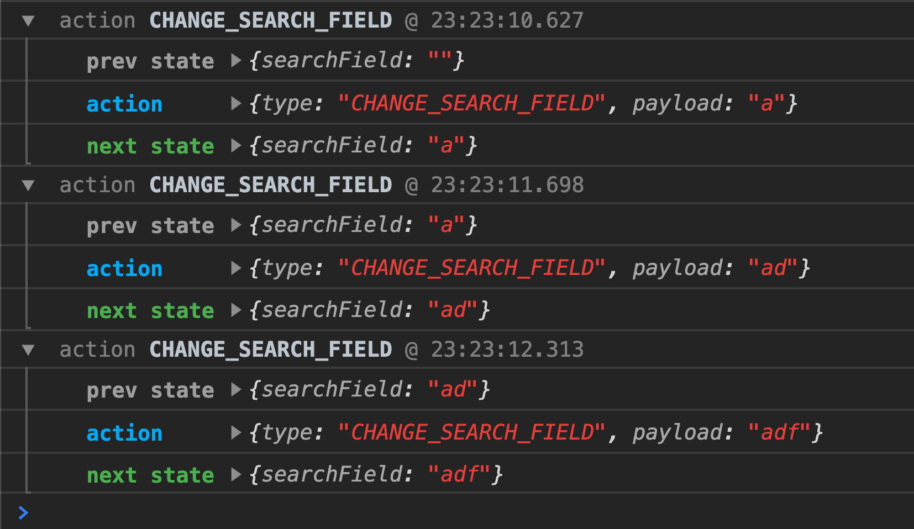

### Middlewares

It simply listens for actions much like a tunnel that actions go through and depending on what the middleware is, it can modify the action or trigger another action. So they are like triggers that actions go through and something happens within this tunnel **before it hits the reducer**.

### Why middleware might be useful for us?

- Logging

```js
yarn add redux-logger
```

#### How to use the logger?

```js
import { createStore, applyMiddleware } from "redux";
import { createLogger } from "redux-logger";

const logger = createLogger();
const store = createStore(searchCharacter, applyMiddleware(logger));
```

Now when an action is dispatched we can see the logs in the console:



- Handling async actions

```js
yarn add redux-thunk
```

- Add thunk middleware:

```js
import thunkMiddleware from "redux-thunk";

const store = createStore(
  // as before
  applyMiddleware(thunkMiddleware, logger)
);
```

- Create three constants for requesting our data (`pending`, `success`, `failure`):

```js
export const REQUEST_CHARACTER_PENDING = "REQUEST_CHARACTER_PENDING";
export const REQUEST_CHARACTER_SUCCESS = "REQUEST_CHARACTER_SUCCESS";
export const REQUEST_CHARACTER_FAILED = "REQUEST_CHARACTER_FAILED";
```

- Create the action:

```js
export const REQUEST_CHARACTER_PENDING = "REQUEST_CHARACTER_PENDING";
export const REQUEST_CHARACTER_SUCCESS = "REQUEST_CHARACTER_SUCCESS";
export const REQUEST_CHARACTER_FAILED = "REQUEST_CHARACTER_FAILED";

// as before

export const requestCharacters = dispatch => {
  dispatch({ type: REQUEST_CHARACTER_PENDING });
  fetch("../data.json")
    .then(response => response.json())
    .then(data => dispatch({ type: REQUEST_CHARACTER_SUCCESS, payload: data }))
    .catch(error =>
      dispatch({ type: REQUEST_CHARACTER_FAILED, payload: error })
    );
};
```

- Add a new reducer:

```js
import {
  CHANGE_SEARCH_FIELD,
  REQUEST_ROBOTS_PENDING,
  REQUEST_ROBOTS_SUCCESS,
  REQUEST_ROBOTS_FAILED
} from "./constants";

const initialStateCharacters = {
  isPending: false,
  characters: [],
  error: ""
};
export const requestCharacter = (
  state = initialStateCharacters,
  action = {}
) => {
  switch (action.type) {
    case REQUEST_CHARACTER_PENDING:
      return { ...state, isPending: true };
    case REQUEST_CHARACTER_SUCCESS:
      return { ...state, characters: action.payload, isPending: false };
    case REQUEST_CHARACTER_FAILED:
      return { ...state, error: action.payload, isPending: false };
    default:
      return state;
  }
};
```

- Combine reducers:

```js
import { createStore, applyMiddleware, combineReducers } from "redux";
import { searchCharacter, requestCharacter } from "./store/reducers";

const rootReducer = combineReducers({
  searchCharacter,
  requestCharacter
});
const store = createStore(
  rootReducer,
  applyMiddleware(thunkMiddleware, logger)
);
```

- Update connected components's state:

```js
```
